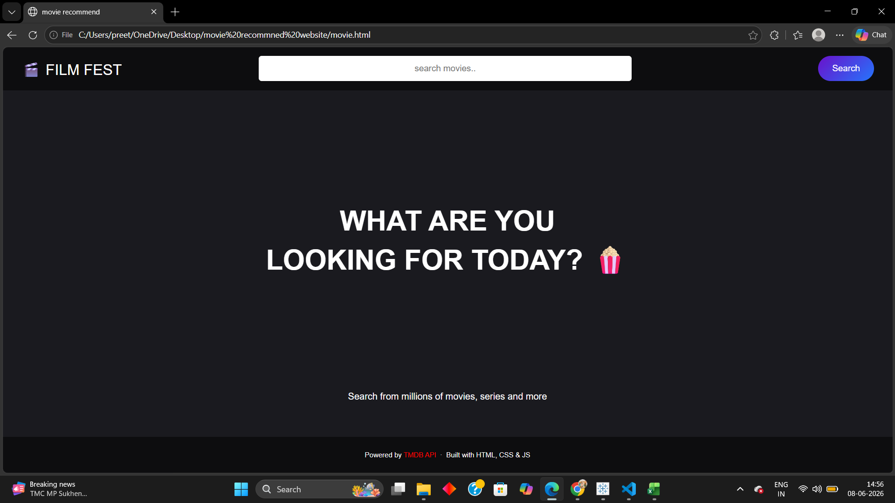
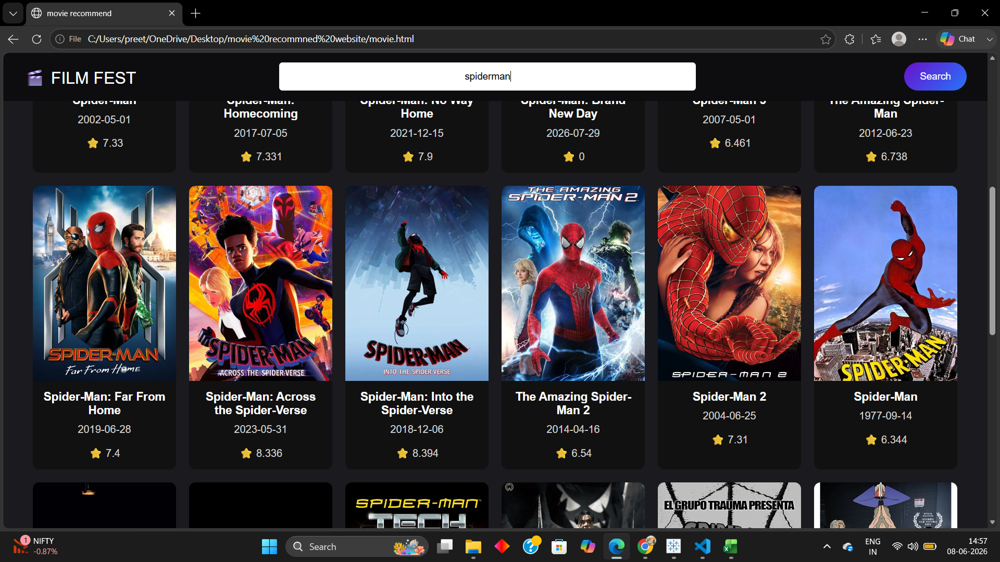
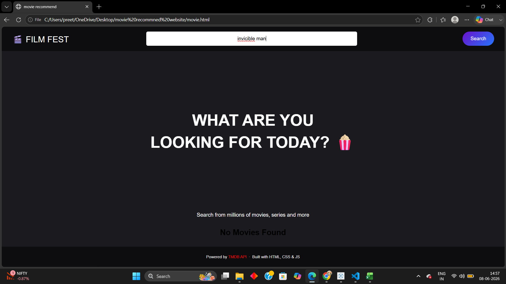
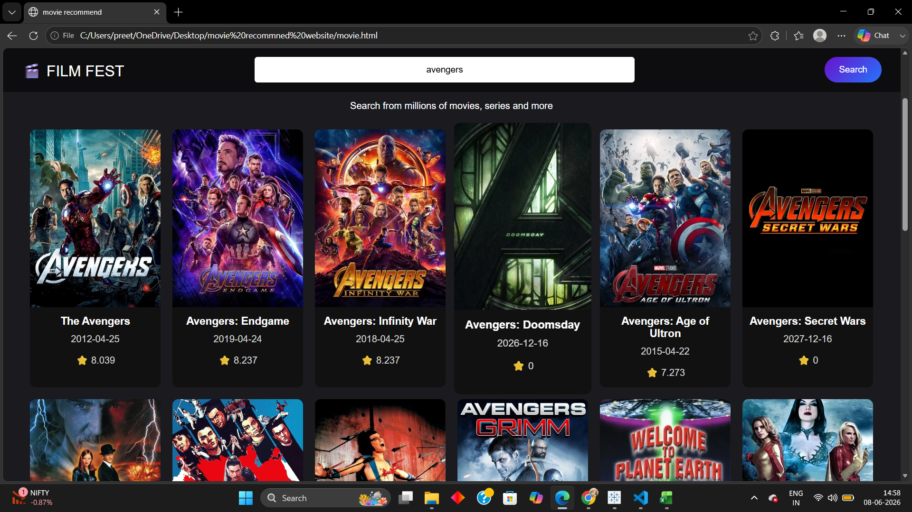

# 🎬 FILM FEST — Movie Recommendation Website

A clean, responsive movie search web app built with **HTML, CSS, and JavaScript**, powered by the **TMDB API**.

---

## 🌐 Live Demo

https://premkumar-42.github.io/Film-Fest/movie.html

---

## 📸 Screenshots

**Home Page**



**Search Results — Spider-Man**



**More Results**



**No Movies Found**



**Avengers Search**


---

## ✨ Features

- 🔍 Search movies by name in real time
- 🎞️ Displays movie poster, title, release date, and rating
- ⭐ TMDB rating shown on each movie card
- ⌨️ Search by pressing **Enter** or clicking the **Search** button
- 📭 Shows "No Movies Found" message for invalid searches
- 📱 Responsive layout with hover animations on cards

---

## 🛠️ Tech Stack

| Technology | Purpose |
|------------|---------|
| HTML5 | Page structure |
| CSS3 | Styling, animations, layout |
| JavaScript (Vanilla) | API calls, DOM manipulation |
| [TMDB API](https://developer.themoviedb.org/docs/getting-started) | Movie data source |

---

## 🚀 Getting Started

### 1. Clone the repository

```bash
git clone https://github.com/YOUR_USERNAME/film-fest.git
cd film-fest
```

### 2. Get a TMDB API Key

1. Go to [https://www.themoviedb.org/](https://www.themoviedb.org/) and create a free account
2. Navigate to **Settings → API** and request an API key
3. Copy your API key

### 3. Add your API Key

Open `movie.js` and replace the API key:

```js
const API_KEY = "your_api_key_here";
```

### 4. Open the project

Simply open `movie.html` in your browser — no build tools or server needed!

---

## 📁 Project Structure

```
film-fest/
│
├── movie.html               # Main HTML file
├── movie.css                # Styles and layout
├── movie.js                 # JavaScript logic & API calls
├── Screenshot__462_.png     # Home page screenshot
├── Screenshot__463_.png     # Search results screenshot
├── Screenshot__464_.png     # More results screenshot
├── Screenshot__465_.png     # No results screenshot
├── Screenshot__466_.png     # Avengers search screenshot
└── README.md                # Project documentation
```

---

## 🔧 How It Works

1. User types a movie name in the search bar
2. On button click or Enter key, the app calls the TMDB Search API:
   ```
   https://api.themoviedb.org/3/search/movie?api_key=KEY&query=MOVIE_NAME
   ```
3. Results are dynamically rendered as movie cards showing poster, title, date, and rating

---

## 📌 Future Improvements

- [ ] Add genre filter / sort by rating
- [ ] Movie detail page on card click (overview, cast, trailer)
- [ ] Trending movies on home page load
- [ ] Dark/light theme toggle
- [ ] Pagination or infinite scroll

---

## 🙌 Credits

- Movie data provided by [The Movie Database (TMDB)](https://www.themoviedb.org/)
- Icons by [Font Awesome](https://fontawesome.com/)

---

## 📄 License

This project is open source and available under the [MIT License](LICENSE).

---

> Built with ❤️ using HTML, CSS & JavaScript
